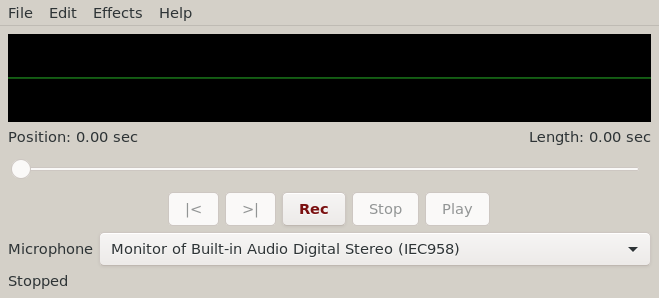

# Needle

**Vended by Grok Build**



A **Sound Recorder** for The Lunduke Computer Operating System (LCOS). The window is Windows 95 Sound Recorder, not GNOME.

Binary: `needle`. Unlicense.

LCOS itself: [https://github.com/BryanLunduke/LCOS](https://github.com/BryanLunduke/LCOS)

## Status

**v1.0.12.** An opened sound keeps its rate and channel count, and Save leaves it alone until the tape changes. **v1.0.11.** Record, stop, and play a WAV; microphone combo; green level trace; seek slider; last folder. Save As / Open WAV, FLAC, Ogg Vorbis, MP3 (tape stays WAV). Effects: volume, speed, echo, reverse. Headless test suite and BUG-BACKLOG.md. See [INSTALL.md](INSTALL.md) and [DEVELOPMENT.md](DEVELOPMENT.md).

| Doc | What |
|---|---|
| [DEVELOPMENT.md](DEVELOPMENT.md) | Locked decisions, architecture, milestones, branching, semver, lint |

## Build

```
sudo apt install build-essential meson ninja-build pkg-config g++ libgtkmm-3.0-dev libgstreamer1.0-dev libgstreamer-plugins-base1.0-dev gstreamer1.0-plugins-base gstreamer1.0-plugins-good gstreamer1.0-pulseaudio clang-format cppcheck
meson setup build
meson compile -C build
./build/needle
```

PR lint gate: `./scripts/lint.sh` (CI runs this; no `--fix`). Format `src/` locally with `./scripts/lint.sh --fix`.

## License

[The Unlicense](https://unlicense.org). See [UNLICENSE](UNLICENSE).
